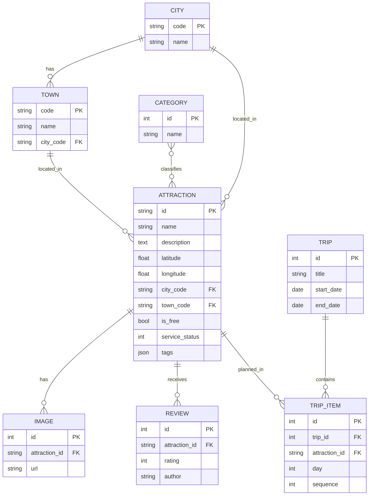

# 🏞️ Taiwan Tourism Open Data RESTful API

以 **交通部觀光署「景點 - 觀光資訊資料庫」** 政府開放資料（全台 **6,226** 筆景點、22 縣市、348 鄉鎮市區、10,725 張圖片）為基礎，
使用 **Python + FastAPI + SQLite** 實作的完整 RESTful API Server，提供 **8 種 Resource、57 個 API 操作**，每個 Resource 皆支援完整 CRUD。

| 項目 | 內容 |
|---|---|
| Open Data 來源 | [政府資料開放平臺 #7777 景點 - 觀光資訊資料庫](https://data.gov.tw/dataset/7777)（觀光資料標準 V2.1，每日更新） |
| Open Data 資料檔 | [`data/AttractionList.json`](data/AttractionList.json)（單一 JSON 檔，16 MB，下載日期 2026-09-26） |
| 技術 | Python 3.13 · FastAPI · SQLAlchemy 2 · Pydantic 2 · SQLite · Uvicorn |
| API 文件 | Swagger UI：`http://127.0.0.1:8000/docs`　ReDoc：`/redoc`　規格檔：[`docs/openapi.json`](docs/openapi.json) / [`docs/openapi.yaml`](docs/openapi.yaml)　靜態版：[`docs/index.html`](docs/index.html) |
| 實測範例 | [`docs/API_EXAMPLES.md`](docs/API_EXAMPLES.md)（66 組 Request / Response，由 API Client 實際執行自動產生） |
| API Client | Python Client：[`client/api_client.py`](client/api_client.py)　Postman：[`postman/Taiwan-Tourism-API.postman_collection.json`](postman/Taiwan-Tourism-API.postman_collection.json) |
| 自動化測試 | [`tests/test_api.py`](tests/test_api.py)（pytest，23 個測試案例） |
| AI 輔助開發 | [`CLAUDE.md`](CLAUDE.md)、[`docs/AI_DEVELOPMENT.md`](docs/AI_DEVELOPMENT.md) |
| 雲端部署 | `<部署後填入 API Server URL>`（已附 [`Dockerfile`](Dockerfile) 與 [`render.yaml`](render.yaml)） |

---

## ✨ 功能特色

- **完整 CRUD**：8 種 Resource 皆提供 `GET`（列表 / 單筆）、`POST`、`PUT`（整筆取代）、`PATCH`（部分更新）、`DELETE`
- **資料正規化**：將巢狀的原始 JSON 拆成 9 張關聯式資料表匯入 SQLite，並設定外鍵與串聯刪除
- **強大查詢**：關鍵字搜尋、縣市 / 鄉鎮 / 類型 / 免費 / 營運狀態 / 標籤 / 有無圖片等多條件篩選、排序、分頁
- **地理查詢**：`/attractions/nearby` 以 Haversine 公式找出指定經緯度半徑內的景點並依距離排序
- **加值資源**：在原始資料之上設計「遊客評論 (reviews)」與「旅遊行程 (trips)」，讓 API 更貼近實際應用
- **統計 API**：各縣市 / 各類型景點數、評價最高景點、資料總覽
- **符合 REST 慣例**：正確的 HTTP 狀態碼（200 / 201 / 204 / 401 / 403 / 404 / 409 / 422）、`Location` header、`X-Total-Count` header、巢狀子資源路徑
- **資料驗證**：Pydantic 驗證欄位格式與範圍，並檢查參照完整性（例：鄉鎮必須屬於該縣市、行程結束日不可早於開始日）
- **API Key 保護**：讀取公開；新增 / 修改 / 刪除需帶 `X-API-Key` header
- **完整測試**：pytest 自動化測試 + Python API Client 端對端測試 + Postman Collection（Newman 實測 68/68 通過）

---

## 🗂️ 資源設計 (Resources)



| Resource | 來源 | 說明 |
|---|---|---|
| `attractions` | Open Data | 景點主資料（名稱、描述、座標、地址、電話、營業時間、交通、票價、標籤…） |
| `attractions/{id}/images` | Open Data | 景點圖片（子資源） |
| `categories` | Open Data（觀光資料標準代碼表） | 景點類型：文化類、生態類、森林遊樂區類…共 28 類 |
| `cities` / `towns` | Open Data（由地址正規化） | 縣市 / 鄉鎮市區 |
| `reviews` | 本專案新增 | 遊客對景點的評論與 1~5 星評分 |
| `trips` / `trips/{id}/items` | 本專案新增 | 旅遊行程，以及行程中每天要去的景點 |
| `stats` | 彙總計算 | 統計資訊（唯讀） |

---

## 📑 API 一覽（共 57 個操作）

> Base URL：`http://127.0.0.1:8000`　🔒 = 需帶 `X-API-Key` header

<details open>
<summary><b>Attractions 景點</b></summary>

| Method | Path | 說明 | |
|---|---|---|---|
| `GET` | `/api/v1/attractions` | 查詢景點列表（分頁、篩選、排序） | |
| `GET` | `/api/v1/attractions/nearby` | 查詢附近景點（依距離排序） | |
| `GET` | `/api/v1/attractions/{attraction_id}` | 取得單一景點詳細資料（含圖片、類型、平均評分） | |
| `POST` | `/api/v1/attractions` | 新增景點 | 🔒 |
| `PUT` | `/api/v1/attractions/{attraction_id}` | 整筆更新景點 | 🔒 |
| `PATCH` | `/api/v1/attractions/{attraction_id}` | 部分更新景點 | 🔒 |
| `DELETE` | `/api/v1/attractions/{attraction_id}` | 刪除景點（連同圖片、評論、行程項目） | 🔒 |

`GET /api/v1/attractions` 查詢參數：

| 參數 | 說明 | 範例 |
|---|---|---|
| `q` | 關鍵字（名稱、別名、描述、地址） | `老街` |
| `city` / `city_code` | 縣市名稱（台/臺皆可）/ 代碼 | `臺北` / `63000` |
| `town_code` | 鄉鎮市區代碼 | `63000050` |
| `category_id` | 景點類型，可重複帶入 | `category_id=4&category_id=16` |
| `is_free` | 是否免費 | `true` |
| `service_status` | 營運狀態（0 永久停止、1 正常、2 非營運時段、3 暫停、9 待確認） | `1` |
| `has_image` | 是否有圖片 | `true` |
| `tag` | 標籤 | `賞楓` |
| `sort` | `id`、`name`、`-name`、`updated_at`、`-updated_at`、`source_update_time`、`-source_update_time` | `-name` |
| `page` / `page_size` | 分頁（page_size 最大 100） | `1` / `20` |

</details>

<details>
<summary><b>Attraction Images 景點圖片</b></summary>

| Method | Path | 說明 | |
|---|---|---|---|
| `GET` | `/api/v1/attractions/{attraction_id}/images` | 列出景點的所有圖片 | |
| `GET` | `/api/v1/attractions/{attraction_id}/images/{image_id}` | 取得單張圖片 | |
| `POST` | `/api/v1/attractions/{attraction_id}/images` | 新增景點圖片 | 🔒 |
| `PUT` | `/api/v1/attractions/{attraction_id}/images/{image_id}` | 整筆更新圖片 | 🔒 |
| `PATCH` | `/api/v1/attractions/{attraction_id}/images/{image_id}` | 部分更新圖片 | 🔒 |
| `DELETE` | `/api/v1/attractions/{attraction_id}/images/{image_id}` | 刪除圖片 | 🔒 |
</details>

<details>
<summary><b>Categories 景點類型</b></summary>

| Method | Path | 說明 | |
|---|---|---|---|
| `GET` | `/api/v1/categories` | 列出景點類型（含各類景點數） | |
| `GET` | `/api/v1/categories/{category_id}` | 取得單一景點類型 | |
| `POST` | `/api/v1/categories` | 新增景點類型 | 🔒 |
| `PUT` | `/api/v1/categories/{category_id}` | 整筆更新景點類型 | 🔒 |
| `PATCH` | `/api/v1/categories/{category_id}` | 部分更新景點類型 | 🔒 |
| `DELETE` | `/api/v1/categories/{category_id}` | 刪除景點類型（只移除關聯，不刪景點） | 🔒 |
</details>

<details>
<summary><b>Cities 縣市 / Towns 鄉鎮市區</b></summary>

| Method | Path | 說明 | |
|---|---|---|---|
| `GET` | `/api/v1/cities` | 列出縣市 | |
| `GET` | `/api/v1/cities/{city_code}` | 取得單一縣市 | |
| `GET` | `/api/v1/cities/{city_code}/towns` | 列出縣市底下的鄉鎮市區 | |
| `POST` | `/api/v1/cities` | 新增縣市 | 🔒 |
| `PUT` | `/api/v1/cities/{city_code}` | 整筆更新縣市 | 🔒 |
| `PATCH` | `/api/v1/cities/{city_code}` | 部分更新縣市 | 🔒 |
| `DELETE` | `/api/v1/cities/{city_code}` | 刪除縣市（仍有景點時回 409，加 `?force=true` 強制刪除） | 🔒 |
| `GET` | `/api/v1/towns` | 列出鄉鎮市區（可依 `city_code` 篩選） | |
| `GET` | `/api/v1/towns/{town_code}` | 取得單一鄉鎮市區 | |
| `POST` | `/api/v1/towns` | 新增鄉鎮市區 | 🔒 |
| `PUT` | `/api/v1/towns/{town_code}` | 整筆更新鄉鎮市區 | 🔒 |
| `PATCH` | `/api/v1/towns/{town_code}` | 部分更新鄉鎮市區 | 🔒 |
| `DELETE` | `/api/v1/towns/{town_code}` | 刪除鄉鎮市區（同上，支援 `force`） | 🔒 |
</details>

<details>
<summary><b>Reviews 評論</b></summary>

| Method | Path | 說明 | |
|---|---|---|---|
| `GET` | `/api/v1/reviews` | 查詢評論（可依景點、作者、評分範圍篩選與排序） | |
| `GET` | `/api/v1/reviews/{review_id}` | 取得單一評論 | |
| `GET` | `/api/v1/attractions/{attraction_id}/reviews` | 列出某景點的評論 | |
| `POST` | `/api/v1/reviews` | 新增評論 | 🔒 |
| `POST` | `/api/v1/attractions/{attraction_id}/reviews` | 為某景點新增評論 | 🔒 |
| `PUT` | `/api/v1/reviews/{review_id}` | 整筆更新評論 | 🔒 |
| `PATCH` | `/api/v1/reviews/{review_id}` | 部分更新評論 | 🔒 |
| `DELETE` | `/api/v1/reviews/{review_id}` | 刪除評論 | 🔒 |
</details>

<details>
<summary><b>Trips 旅遊行程 / Trip Items 行程項目</b></summary>

| Method | Path | 說明 | |
|---|---|---|---|
| `GET` | `/api/v1/trips` | 列出旅遊行程 | |
| `GET` | `/api/v1/trips/{trip_id}` | 取得行程（含所有行程項目） | |
| `POST` | `/api/v1/trips` | 建立行程（可同時帶入行程項目） | 🔒 |
| `PUT` | `/api/v1/trips/{trip_id}` | 整筆更新行程（行程項目整批取代） | 🔒 |
| `PATCH` | `/api/v1/trips/{trip_id}` | 部分更新行程 | 🔒 |
| `DELETE` | `/api/v1/trips/{trip_id}` | 刪除行程 | 🔒 |
| `GET` | `/api/v1/trips/{trip_id}/items` | 列出行程項目（可依 `day` 篩選） | |
| `GET` | `/api/v1/trips/{trip_id}/items/{item_id}` | 取得單一行程項目 | |
| `POST` | `/api/v1/trips/{trip_id}/items` | 新增行程項目 | 🔒 |
| `PUT` | `/api/v1/trips/{trip_id}/items/{item_id}` | 整筆更新行程項目 | 🔒 |
| `PATCH` | `/api/v1/trips/{trip_id}/items/{item_id}` | 部分更新行程項目 | 🔒 |
| `DELETE` | `/api/v1/trips/{trip_id}/items/{item_id}` | 刪除行程項目 | 🔒 |
</details>

<details>
<summary><b>Stats 統計 / System</b></summary>

| Method | Path | 說明 |
|---|---|---|
| `GET` | `/api/v1/stats/overview` | 資料總覽 |
| `GET` | `/api/v1/stats/cities` | 各縣市景點數量 |
| `GET` | `/api/v1/stats/categories` | 各類型景點數量 |
| `GET` | `/api/v1/stats/top-rated` | 評價最高的景點 |
| `GET` | `/health` | 健康檢查 |
</details>

### 回應格式

列表（分頁）：
```json
{ "total": 6226, "page": 1, "page_size": 20, "pages": 312, "items": [ ... ] }
```
錯誤：
```json
{ "detail": "Attraction 'xxx' 不存在" }
```

| 狀態碼 | 意義 |
|---|---|
| `200 OK` | 查詢 / 更新成功 |
| `201 Created` | 新增成功（附 `Location` header） |
| `204 No Content` | 刪除成功 |
| `401 Unauthorized` / `403 Forbidden` | 未帶 API Key / API Key 錯誤 |
| `404 Not Found` | 資源不存在 |
| `409 Conflict` | ID / 名稱重複，或刪除仍被使用中的資源 |
| `422 Unprocessable Content` | 欄位驗證失敗、參照的資料不存在 |

---

## 🚀 環境建置與執行

### 1. 需求
- Python 3.11 以上（開發環境為 3.13）

### 2. 安裝
```bash
git clone <本專案 GitHub URL>
cd opendata

python -m venv .venv
# Windows
.venv\Scripts\activate
# macOS / Linux
source .venv/bin/activate

pip install -r requirements.txt
```

### 3. 啟動伺服器
```bash
uvicorn app.main:app --reload
```
首次啟動會自動把 `data/AttractionList.json` 匯入 SQLite（`data/tourism.db`，約 1~2 秒）。
也可手動匯入 / 重建：
```bash
python scripts/import_data.py          # 資料庫為空時匯入
python scripts/import_data.py --reset  # 清空後重新匯入
```

### 4. 開啟 API 文件
- Swagger UI：<http://127.0.0.1:8000/docs>（按右上角 **Authorize** 輸入 `ntub-iot-2026` 即可測試寫入操作）
- ReDoc：<http://127.0.0.1:8000/redoc>
- OpenAPI 規格：<http://127.0.0.1:8000/openapi.json>

### 5. 環境變數（選用）
| 變數 | 預設值 | 說明 |
|---|---|---|
| `API_KEY` | `ntub-iot-2026` | 寫入操作的 API Key；設為空字串則停用驗證 |
| `DB_FILE` | `data/tourism.db` | SQLite 檔案位置 |
| `DATA_FILE` | `data/AttractionList.json` | Open Data 原始檔位置 |

---

## 🧪 測試

### A. 自動化測試（pytest）
```bash
pytest -v
```
使用獨立的暫存資料庫，涵蓋所有 Resource 的 CRUD、查詢、驗證失敗、權限、串聯刪除等 23 個案例。

### B. Python API Client
```bash
# 先啟動伺服器，再開另一個終端機執行：
python client/api_client.py                                  # 執行 66 個請求並顯示 PASS / FAIL
python client/api_client.py --record docs/API_EXAMPLES.md    # 同時輸出 Request / Response 實測範例
```
`TourismAPIClient` 類別封裝了所有 API，也可在其他程式中使用：
```python
from client.api_client import TourismAPIClient

api = TourismAPIClient("http://127.0.0.1:8000", api_key="ntub-iot-2026")
print(api.list_attractions(city="臺北", category_id=4, page_size=5).json())
print(api.nearby_attractions(25.0421, 121.5253, radius_km=1).json())
api.create_attraction_review("Attraction_345040000G_000001", {"author": "我", "rating": 5})
```

### C. Postman
1. Postman → **Import** → 選擇 `postman/Taiwan-Tourism-API.postman_collection.json`
2. Collection 變數已預設 `baseUrl = http://127.0.0.1:8000`、`apiKey = ntub-iot-2026`
3. 對 Collection 按 **Run** 即可依序執行 68 個請求（每個請求都有檢查 Status Code 的測試）

或使用命令列（需 Node.js）：
```bash
npx newman run postman/Taiwan-Tourism-API.postman_collection.json
```

---

## ☁️ 部署

**Docker**
```bash
docker build -t tourism-api .
docker run -p 8000:8000 tourism-api
```

**Render.com（免費）**：將專案推上 GitHub → Render 選 **New → Blueprint** → 選此 repo，會依 [`render.yaml`](render.yaml) 自動部署。

---

## 📁 專案結構

```
opendata/
├── data/
│   └── AttractionList.json      # Open Data 原始資料檔（交通部觀光署）
├── app/                         # FastAPI 伺服器
│   ├── main.py                  # 應用程式進入點、Middleware、Router 註冊
│   ├── config.py                # 設定（環境變數）
│   ├── database.py              # SQLAlchemy 引擎 / Session
│   ├── models.py                # ORM 資料表模型
│   ├── schemas.py               # Pydantic Request / Response 模型
│   ├── enums.py                 # 觀光資料標準代碼表
│   ├── seed.py                  # Open Data JSON → SQLite 匯入
│   ├── security.py              # API Key 驗證
│   ├── common.py                # 分頁、錯誤處理、序列化共用函式
│   └── routers/                 # 各 Resource 的 API
│       ├── attractions.py       #   景點 + 圖片
│       ├── categories.py        #   景點類型
│       ├── regions.py           #   縣市 + 鄉鎮
│       ├── reviews.py           #   評論
│       ├── trips.py             #   行程 + 行程項目
│       └── stats.py             #   統計
├── client/api_client.py         # Python API Client + 端對端測試 + 範例產生器
├── tests/test_api.py            # pytest 自動化測試
├── postman/                     # Postman Collection 匯出檔
├── scripts/
│   ├── import_data.py           # 匯入 / 重建資料庫
│   ├── export_openapi.py        # 匯出 openapi.json / yaml / 靜態 Swagger UI
│   └── generate_postman.py      # 產生 Postman Collection
├── docs/
│   ├── openapi.json / .yaml     # API 規格
│   ├── index.html               # 靜態 Swagger UI（免啟動伺服器）
│   ├── API_EXAMPLES.md          # API 實測範例
│   └── AI_DEVELOPMENT.md        # AI 輔助開發紀錄
├── CLAUDE.md                    # AI 輔助開發工具（Claude Code）專案設定
├── requirements.txt
├── Dockerfile / render.yaml     # 部署設定
└── README.md
```

---

## 🤖 AI 輔助開發

本專案使用 **Claude Code**（Anthropic 的 AI 程式開發 CLI 工具）協助資料分析、API 設計、程式實作與測試。
- [`CLAUDE.md`](CLAUDE.md)：提供給 AI 的專案說明與開發規範（AI 輔助開發設定檔）
- [`docs/AI_DEVELOPMENT.md`](docs/AI_DEVELOPMENT.md)：開發流程、使用的 Prompt 與 AI 產出的設計決策紀錄

---

## 📜 資料授權

資料來源：交通部觀光署，依 [政府資料開放授權條款－第1版](https://data.gov.tw/license) 使用。
